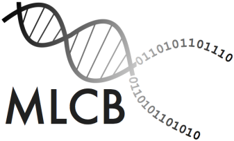

This is the [Homebrew](https://brew.sh) tap repository of the [Machine Learning and Computational Biology
Lab](https://www.bsse.ethz.ch/mlcb), led by [Prof. Karsten Borgwardt](https://www.bsse.ethz.ch/mlcb/karsten.html).

To use the formulas in this repository, please issue the following
command:

    $ brew tap BorgwardtLab/mlcb

This will import *all* formulas into your local installation such
that you may use

    $ brew install NAME

subsequently in order to install individual packages.

# Packages

- [DIPHA](https://github.com/BorgwardtLab/dipha): A distributed persistent homology algorithm

- [Ripser](https://github.com/Ripser/ripser): A lean C++ code for the computation of Vietoris–Rips persistence barcodes

- [Rivet](https://github.com/rivetTDA/rivet): A tool for Topological Data Analysis, in particular two-parameter persistent homology

- [S3M](https://github.com/BorgwardtLab/S3M): A package for statistically significant shapelet mining

- [SiNIMin](https://github.com/BorgwardtLab/SiNIMin): A package for significant network interval mining
